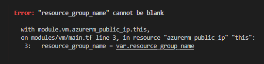
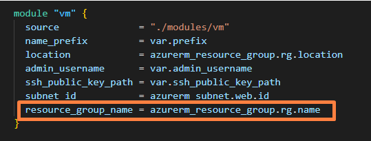
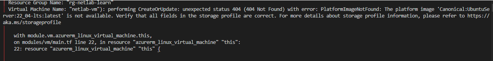
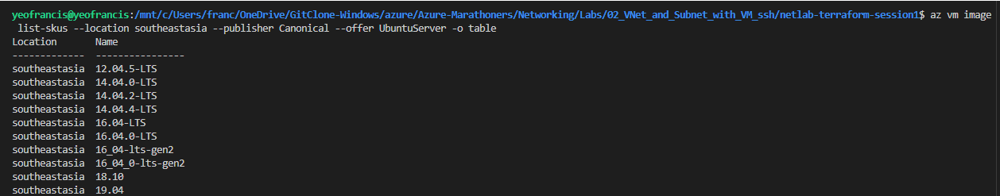
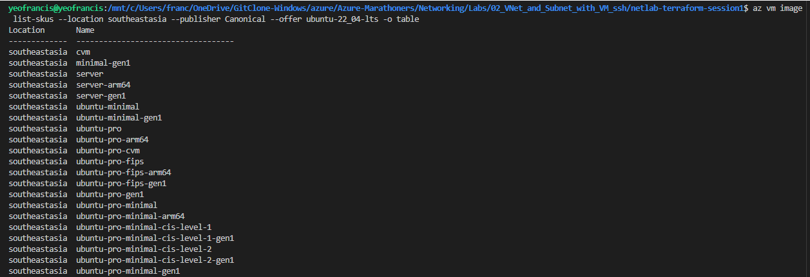
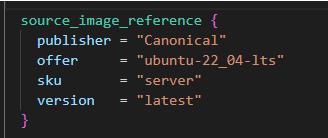

# Session 1 — Azure Networking Foundations (VNet + VM + SSH)  
**Date:** 14-12-25  
**Owner:** Francis

---

## Summary
Session 1 complete. Provisioned a minimal VNet + subnet and an Ubuntu VM with Terraform, SSHed in, verified basic networking (addressing, routing, DNS, outbound). Troubleshooting notes and sanitized evidence are included.

**Status:** ✅ Completed

---

## Objectives (why we did this lab)
1. Learn VNet & subnet basics (isolation, addressing).  
2. See how NICs, private IPs and Public IPs connect a VM to the VNet and internet.  
3. Verify platform behaviour: default gateway (Azure), DNS resolver, and outbound NAT.  
4. Practice Terraform workflow (`init`, `plan`, `apply`, `destroy`) and simple module usage (root ↔ module inputs/outputs).

---

## Architecture (logical)
- Resource Group: `rg-netlab-learn`  
- Virtual Network: `netlab-vnet` — `10.10.0.0/16`  
- Subnet: `web-subnet` — `10.10.1.0/24`  
- VM: `netlab-vm` (Ubuntu 22.04 LTS)  
- Observed Public IP: `4.194.19.144` (may be managed outside current state)

---

## What we ran inside the VM & WHY (the 4 verification commands)
Short, repeatable checks that prove core networking concepts.

1. `ip addr show | awk ...`  
   **Goal:** show VM private IP and interface (e.g. `10.10.1.4/24 on eth0`).  
   **Why:** confirms VM received address from the expected subnet.

2. `ip route | head -n1`  
   **Goal:** show default route (e.g. `default via 10.10.1.1 dev eth0`).  
   **Why:** confirms Azure platform gateway is the default route and outbound behaviour.

3. `cat /etc/resolv.conf`  
   **Goal:** show resolver config (systemd stub or DNS servers).  
   **Why:** verifies DNS setup used by the VM.

4. `ping -c 4 8.8.8.8`  
   **Goal:** test outbound reachability (ICMP).  
   **Why:** quick confirmation of outbound NAT/routing to internet.

These map to addressing, routing, DNS, and NAT — the four pillars we wanted to confirm.

---

## Evidence (sanitized and committed)
**Public (committed)** — `netlab-terraform-session1/evidence_public/`  
- `blog_week1.md` (tiny summary)  
- `ip_addr.txt` (private IP **redacted** as `<REDACTED_IP>`)  
- `ip_route.txt` (default route, sensitive values redacted)  
- `resolv_conf.txt` (sanitized)  
- `ping.txt` (ping summary with latency kept, IPs redacted)  
- `tf_outputs.json` (sanitized copy)

**Private (NOT committed)** — `netlab-terraform-session1/evidence_private/` (raw outputs: full IPs, timestamps, tfstate) — **ignored** via repo `.gitignore`.

Why split: keep proof visible but avoid leaking real IPs, hostnames or state blobs.


---

## Key troubleshooting hit & fixes
1. **resource_group_name cannot be blank**  
   - Cause: module expected `resource_group_name` but root didn’t pass it.  
   - Fix: passed `resource_group_name = azurerm_resource_group.rg.name` in root; added `trimspace()` validation for the module variable.
   
       

       

2. **PlatformImageNotFound (Ubuntu 22.04)**  
   - Cause: the requested image SKU/offer wasn’t available for the chosen region offer.  
   - Fix: discovered the correct image using Azure CLI and settled on `Canonical:ubuntu-22_04-lts:server:latest` (or specific URN) — no marketplace/pro cost.

   

   

   

   

3. **SSH public-key path error** (`file()` complaining no file exists)  
   - Cause: Terraform saw `~` or wrong username path (`/home/francis/...`) and could not read the file at plan time.  
   - Fix: set absolute path for `ssh_public_key_path` (or export `TF_VAR_ssh_public_key_path`) to `/home/yeofrancis/.ssh/az-netlab-key.pub` and persisted it in `~/.bashrc` so future runs are repeatable.

---
## Terraform lifecycle:
   terraform init
   terraform plan -var-file="lab.tfvars" -out=tfplan
   terraform apply "tfplan"
 # when done:
   terraform destroy -auto-approve

## Next actions
1. Harden SSH via NSG (restrict to your IP).  
2. Add NSG + rules in Terraform in Session 2 (we’ll convert the ad-hoc fix into IaC).  
3. Destroy lab when done to avoid charges: `terraform destroy -auto-approve`.

---

## Commands & safe cleanup (short)
- To destroy now (non-interactive):
```bash
terraform destroy -auto-approve


## Local cleanup

# from repo root (only if you won't re-run the lab immediately)
rm -rf .terraform .terraform.lock.hcl
rm -f *.tfplan tfplan tfplan_nsg tfplan2
rm -f evidence/tfstate.json evidence/tf_outputs.json  # optional, if you don't want snapshots
# keep .tf files and README.md

